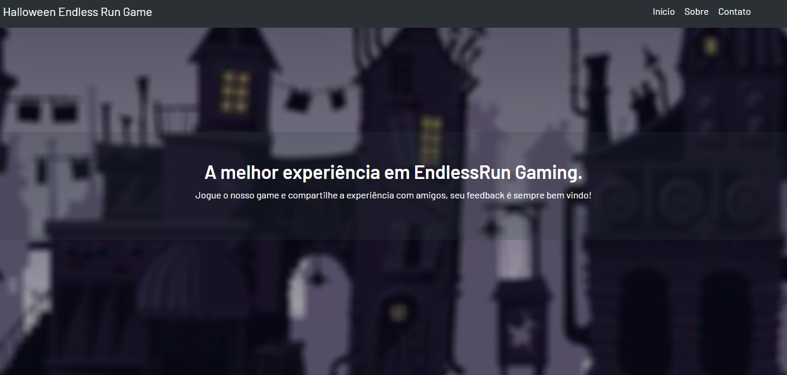

# 🎃 Pumpkin Run - Website

> Um website moderno e responsivo que apresenta o jogo endless runner Pumpkin Run com sistema de ranking em tempo real e controles administrativos.

## 🌟 Funcionalidades

- **Sistema de Ranking em Tempo Real** - Placar dinâmico com pontuações ao vivo dos jogadores
- **Design UI/UX Moderno** - Interface limpa e responsiva com animações suaves
- **Painel Administrativo** - Controles de admin seguros para gerenciamento do ranking
- **Gerenciamento Global de Jogadores** - Sistema baseado em nuvem para rastreamento mundial de pontuações
- **Responsivo para Mobile** - Otimizado para todos os dispositivos e tamanhos de tela
- **Performance Otimizada** - Carregamento rápido com estratégias eficientes de cache

## 🚀 Demo Online

- **Website**: [https://site-endless-run-game.vercel.app/](https://site-endless-run-game.vercel.app/)
- **Jogo**: [https://pumpkin-run.vercel.app/](https://pumpkin-run.vercel.app/)

## 🛠️ Tecnologias

- **Frontend**: HTML5, CSS3, JavaScript (ES6+)
- **Design**: CSS Grid Moderno, Flexbox, CSS Variables
- **Integração de API**: Consumo de API RESTful
- **Armazenamento em Nuvem**: JSONBin.io para gerenciamento global de dados
- **Deploy**: Plataforma de hospedagem Vercel

## 📱 Design Responsivo

O website é totalmente responsivo e otimizado para:
- 📱 Dispositivos móveis (320px+)
- 📟 Tablets (768px+)
- 💻 Computadores desktop (1200px+)
- 🖥️ Telas grandes (1920px+)

## ⚡ Performance

- ✅ Tempos de carregamento otimizados
- ✅ Sistema de cache eficiente
- ✅ Animações e transições suaves
- ✅ Estrutura amigável para SEO
- ✅ Compatível com acessibilidade

## 🎯 Seções Principais

- **Seção Hero** - Introdução envolvente com call-to-action
- **Personagens do Jogo** - Showcase interativo dos personagens
- **Controles do Jogo** - Instruções visuais dos controles
- **Ranking ao Vivo** - Placar em tempo real dos jogadores
- **Informações da Equipe** - Perfis dos desenvolvedores com integração LinkedIn

## 🔧 Configuração e Instalação

1. Clone o repositório
2. Navegue até o diretório `EndlessRunSite`
3. Configure as configurações da API em `api-config.js` (opcional para recursos globais)
4. Abra `index.html` em um navegador web ou faça deploy em uma plataforma de hospedagem

## 🏆 Conquista Acadêmica

Este projeto foi desenvolvido como parte de um projeto semestral universitário, demonstrando:
- Habilidades de desenvolvimento web full-stack
- Princípios modernos de design UI/UX
- Integração de API e gerenciamento de dados
- Técnicas de web design responsivo
- Estratégias de otimização de performance
